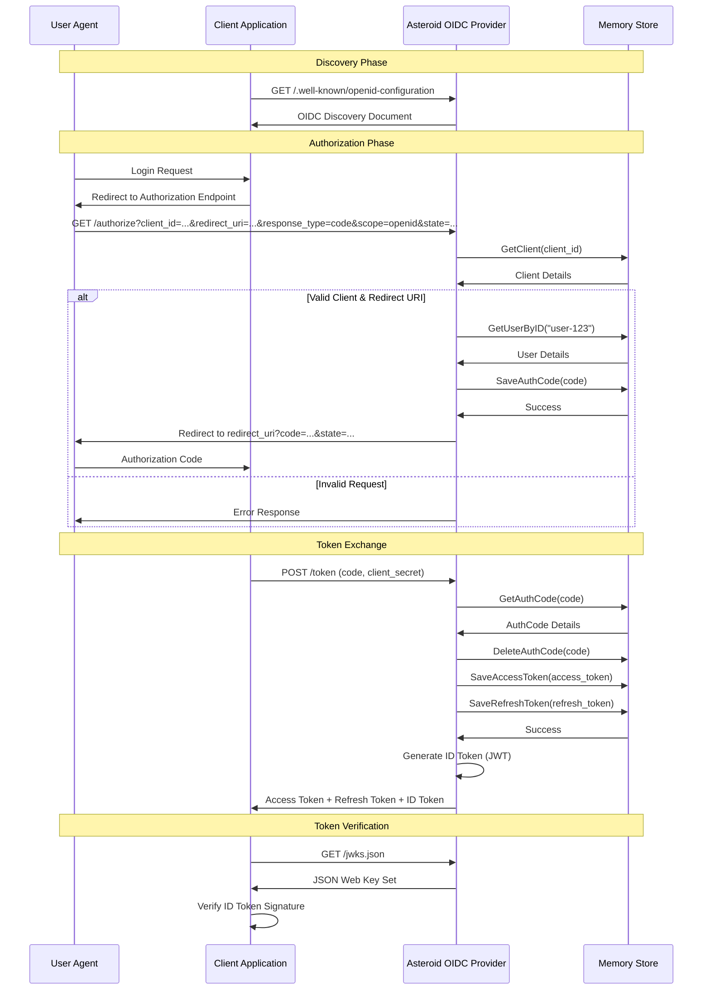

# Asteroid Architecture
Asteroid is a minimal OpenID Connect (OIDC) Provider implemented in Go using the Gin framework.

This document outlines the core architecture, supported flows, and the interactions between the client application, the Asteroid provider, and the storage layer.

## OIDC Authorization Code Flow


## Current Implementation Status

### Implemented
- OIDC Discovery (/.well-known/openid-configuration)
- JWKS endpoint (/jwks.json)
- Authorization endpoint (/authorize)
- Token endpoint (/token)
- ID Token generation (JWT with RS256 signature)
- Multiple storage backends (memory, Redis, DynamoDB)
- Authorization code and refresh token flows
- Access and refresh token generation
- Client authentication and validation
- RSA key management
- Automatic token cleanup and expiration
- Complete OIDC Core 1.0 compliance

### Future Implementation
- UserInfo endpoint (/userinfo)
- Access token validation middleware
- Dynamic user authentication (currently fixed to "user-123")
- PKCE support
- Extended scope handling (profile, email)
- Additional response modes (fragment, form_post)
- Nonce parameter support in ID tokens
- Additional JWT claims (name, email, etc.)

## ID Token Details

Asteroid generates OIDC-compliant ID tokens as JWTs with the following characteristics:

### JWT Header
```json
{
  "alg": "RS256",
  "kid": "unique-key-id",
  "typ": "JWT"
}
```

### JWT Claims
```json
{
  "iss": "http://localhost:8880",
  "sub": "user-123",
  "aud": "test-client",
  "exp": 1763746030,
  "iat": 1763742430,
  "auth_time": 1763742430
}
```

### Verification
- ID tokens are signed with RSA private key using RS256 algorithm
- Public key for verification is available at `/jwks.json` endpoint
- Key ID (`kid`) in JWT header matches the one in JWKS
- Standard JWT validation applies (signature, expiration, issuer, audience)

## Security Considerations

- Dummy user authentication (pre-seeded users from YAML) - for development only
- Auth codes expire after 5 minutes
- Access tokens expire after 1 hour
- Refresh tokens expire after 30 days
- ID tokens expire after 1 hour
- Automatic cleanup of expired tokens and auth codes
- Client secret validation for token exchange
- RSA key-based JWT signing (RS256) for ID tokens
- Redirect URI validation against registered URIs
- TTL-based token storage with automatic expiration
- JWT signature verification via JWKS endpoint
- Standard OIDC claims in ID tokens (iss, sub, aud, exp, iat, auth_time)
