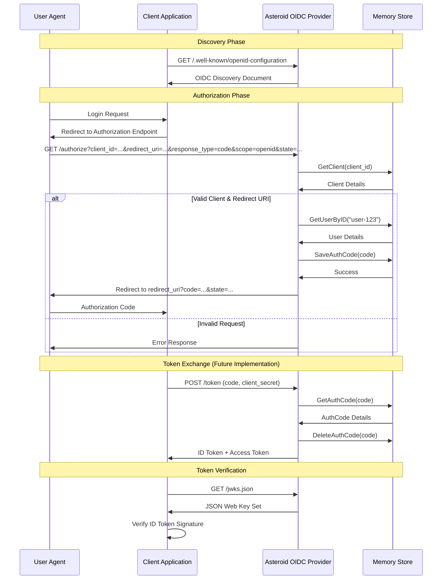

# Asteroid Architecture
Asteroid is a minimal OpenID Connect (OIDC) Provider implemented in Go using the Gin framework.

This document outlines the core architecture, supported flows, and the interactions between the client application, the Asteroid provider, and the storage layer.

## OIDC Authorization Code Flow

## Current Implementation Status

### Implemented
- OIDC Discovery (/.well-known/openid-configuration)
- JWKS endpoint (/jwks.json)
- Authorization endpoint (/authorize)
- Memory-based stores for users, clients, auth codes
- RSA key management
- Authorization code generation and storage

### Future Implementation
- Token endpoint (/token)
- UserInfo endpoint (/userinfo)
- ID Token generation (JWT)
- Access token validation
- Refresh token support
- Proper user authentication
- Client secret validation
- PKCE support
- Scope handling beyond 'openid'

## Security Considerations

- Fixed user authentication (user-123) - for development only
- Auth codes expire after 5 minutes
- Automatic cleanup of expired auth codes
- RSA key-based JWT signing
- Redirect URI validation against registered URIs