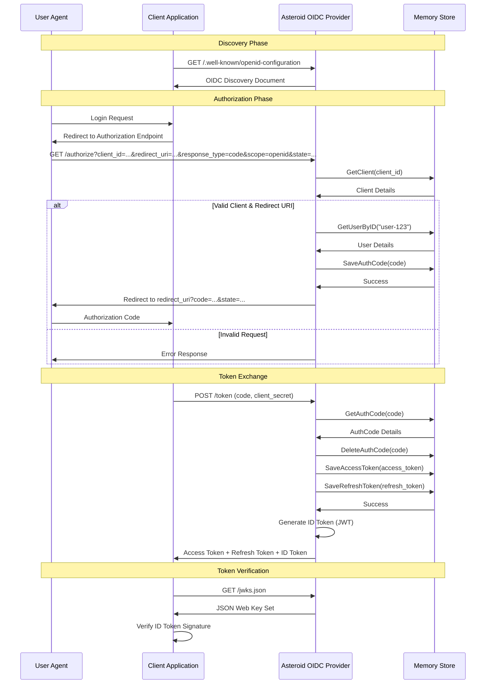

# Asteroid
Asteroid is a minimal OpenID Connect (OIDC) Provider implemented in Go using the Gin framework.

This document outlines the core architecture, layer separation, supported flows, and the interactions between the client application, the Asteroid provider, and the storage layer.

## Architecture Overview

Asteroid follows a clean architecture pattern with clear separation of concerns across three layers: HTTP, Domain, and Storage.

### Layer Responsibilities

#### HTTP Layer (`internal/http/`)
- **Purpose**: HTTP protocol handling and transport concerns
- **Responsibilities**:
  - Request parsing and validation (form data, query parameters)
  - Response formatting (JSON, redirects, error codes)
  - Content-Type handling and HTTP headers
  - HTTP status code mapping
  - Route registration and middleware
- **Principles**:
  - No business logic
  - Thin layer that delegates to domain services
  - Framework-specific code (Gin) isolated here
  - Error handling converts domain errors to HTTP responses

#### Domain Layer (`internal/oidc/`)
- **Purpose**: Core business logic and OIDC protocol implementation
- **Responsibilities**:
  - OIDC Core 1.0 specification compliance
  - OAuth 2.0 authorization flows
  - Security validations (PKCE, nonce, redirect URI)
  - JWT generation and validation
  - Business rule enforcement
  - Protocol-specific error handling
- **Principles**:
  - Framework-agnostic (no HTTP dependencies)
  - Pure business logic functions
  - Dependency injection for stores
  - Domain-specific error types
  - Testable without HTTP infrastructure

#### Storage Layer (`internal/store/`)
- **Purpose**: Data persistence and retrieval abstraction
- **Responsibilities**:
  - Data storage and retrieval operations
  - Entity lifecycle management (TTL, expiration)
  - Storage backend abstraction
  - Transaction and concurrency handling
  - Data serialization/deserialization
- **Principles**:
  - Interface-based design for pluggability
  - Storage backend agnostic
  - Entity models with validation
  - Error handling for storage failures
  - Factory pattern for driver selection

### Cross-Cutting Concerns

#### Configuration (`internal/config/`)
- Build-tag based configuration for different storage backends
- Environment-specific settings
- Storage connection parameters

#### Data Loading (`internal/loader/`)
- YAML-based data initialization
- Separate loaders for different data types (clients, users, keys)
- Bootstrap data management

### Key Architecture Benefits

1. **Testability**: Each layer can be tested independently with mocks
2. **Flexibility**: Storage backends can be swapped without changing business logic
3. **Maintainability**: Clear separation makes code easier to understand and modify
4. **Protocol Compliance**: Domain layer ensures OIDC specification adherence
5. **Scalability**: Interface-based design allows for easy extension

## OIDC Authorization Code Flow


## Current Implementation Status

### Implemented
- **OIDC Discovery** (/.well-known/openid-configuration)
- **JWKS endpoint** (/jwks.json) with RSA public key distribution
- **Authorization endpoint** (/authorize) with comprehensive security validation
- **Token endpoint** (/token) supporting authorization_code and refresh_token grants
- **ID Token generation** (JWT with RS256 signature)
- **Multiple storage backends** (memory, Redis, DynamoDB) with build-tag selection
- **PKCE support** (RFC 7636) with S256 method validation
- **Security features**:
  - Nonce replay protection with per-client isolation
  - Exact redirect URI validation (string-based, no normalization)
  - State parameter enforcement for CSRF protection
  - Authorization code expiration (5 minutes)
  - Access token expiration (1 hour)
  - Refresh token rotation
- **Complete OIDC Core 1.0 compliance**
- **Comprehensive test suite** with unit tests for all critical paths

### Future Implementation
- **UserInfo endpoint** (/userinfo) - framework exists, not exposed
- **Client authentication methods**: client_secret_basic, client_secret_jwt, private_key_jwt
- **Key rotation** with graceful transition
- **Extended scope handling** (profile, email, address, phone)
- **Dynamic user authentication** (currently simplified to pre-configured users)
- **Additional response modes** (fragment, form_post)
- **Token introspection** (RFC 7662) and **revocation** (RFC 7009)
- **Administrative APIs** for client/user management

## ID Token Details

Asteroid generates OIDC-compliant ID tokens as JWTs with the following characteristics:

### JWT Header
```json
{
  "alg": "RS256",
  "kid": "unique-key-id",
  "typ": "JWT"
}
```

### JWT Claims
```json
{
  "iss": "http://localhost:8880",
  "sub": "user-123",
  "aud": "test-client",
  "exp": 1763746030,
  "iat": 1763742430,
  "auth_time": 1763742430,
  "nonce": "client-provided-nonce"
}
```

### Verification
- ID tokens are signed with RSA private key using RS256 algorithm
- Public key for verification is available at `/jwks.json` endpoint
- Key ID (`kid`) in JWT header matches the one in JWKS
- Standard JWT validation applies (signature, expiration, issuer, audience)

## Security Considerations

- Dummy user authentication (pre-seeded users from YAML) - for development only
- Auth codes expire after 5 minutes
- Access tokens expire after 1 hour
- Refresh tokens expire after 30 days
- ID tokens expire after 1 hour
- Automatic cleanup of expired tokens and auth codes
- Client secret validation for token exchange
- RSA key-based JWT signing (RS256) for ID tokens
- Redirect URI validation against registered URIs
- TTL-based token storage with automatic expiration
- JWT signature verification via JWKS endpoint
- Standard OIDC claims in ID tokens (iss, sub, aud, exp, iat, auth_time)
